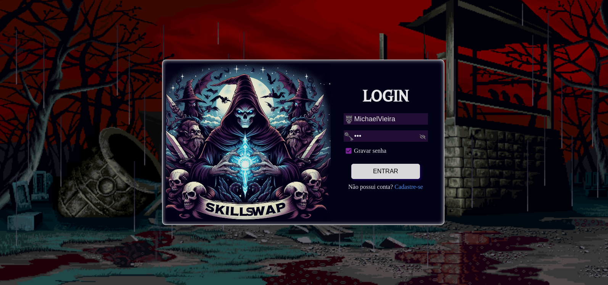
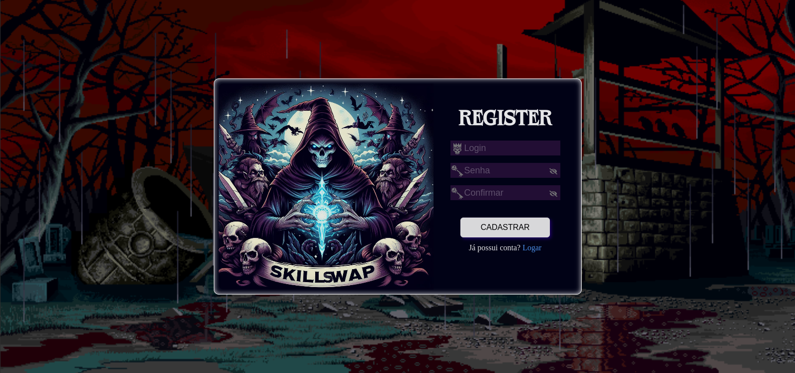
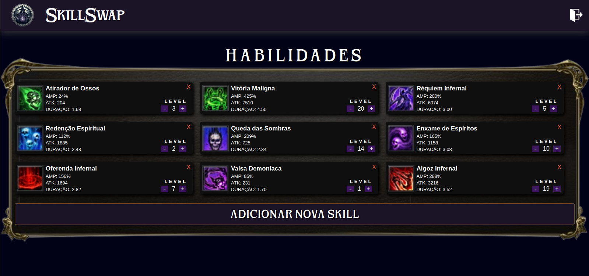
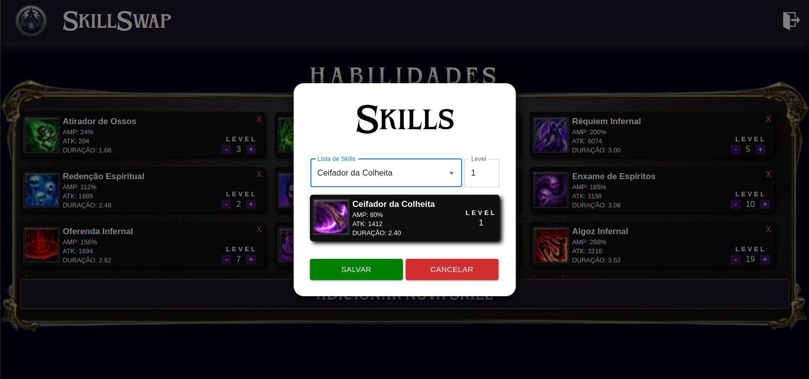

    <h1 style="font-size: 3em">SkillSwap</h1>

O SkillSwap é uma aplicação onde você pode registrar e compartilhar suas habilidades mágicas. Essas habilidades têm a capacidade de variar de LEVEL 1 a 20, apresentando valores distintos em cada atributo. Além disso, ao adquirir novas habilidades, você tem a flexibilidade de ajustar o level ou até mesmo removê-las conforme desejar.

## Tela de Login

- **Campo de Login e Senha:** Permita aos usuários inserir suas credenciais de login e senha de forma segura.
  
- **Visualização de Senha:** Adicionado a opção de visualizar a senha digitada, facilitando a experiência do usuário.

- **Checkbox de Gravar Senha:** Opção de gravar a senha no armazenamento local. Se marcado, salve no storage para preenchimento automático na próxima visita.

- **Botão de Entrar:** Chama o endpoint de login ao clicar, redirecionando para a tela Home se o login estiver correto.

- **Botão de Cadastrar-se:** Redireciona para a tela de cadastro ao clicar.

## Tela de Registro

- **Campos de Login, Senha e Confirmar Senha:** Permita aos usuários inserir suas informações para criar uma nova conta.(MIN:4 MAX:15)

- **Visualização de Senhas Digitadas:** Botões adicionais para visualizar as senhas digitadas, garantindo precisão durante o cadastro.

- **Botão de Salvar:** Valida se as senhas inseridas são iguais antes de chamar o endpoint de cadastro. Exibindo uma mensagem de sucesso após o cadastro.

## Tela Home

- **Lista de Skills:** Apresente uma lista de habilidades que o usuário adicionou, incluindo imagem, nome da skill, level e descrição.

- **Edição de Level na Lista:** Permite a edição do level diretamente na lista, oferecendo uma experiência de usuário fluida.

- **Botão de Excluir Skill:** Possibilita a exclusão de uma skill da lista, proporcionando controle total ao usuário.

- **Botão de Adicionar Skill:** Ao clicar, abre uma modal de cadastro com uma combo de skills proveniente de um endpoint, além de botões para salvar ou cancelar.

- **Botão de Logout:** Forneça aos usuários a opção de fazer logout de forma segura.

### Modal de Novas Skills

## 4. Segurança
- **Restrição de Acesso:** Não permita que o usuário acesse a página Home sem estar autenticado. Garanta uma experiência segura.

- **Validação de Token:** Verifica se o token é válido ao acessar paginas.
